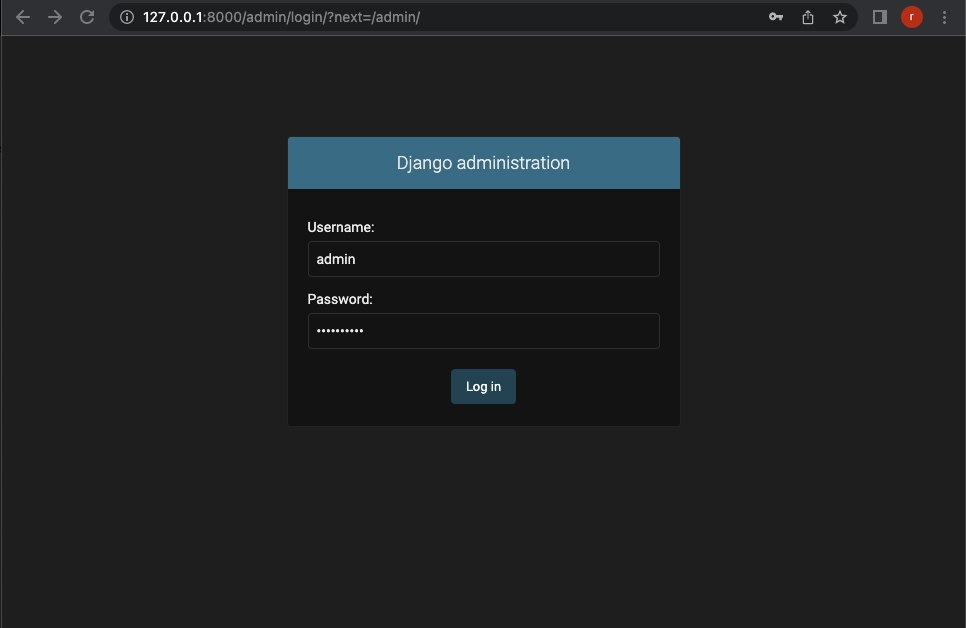
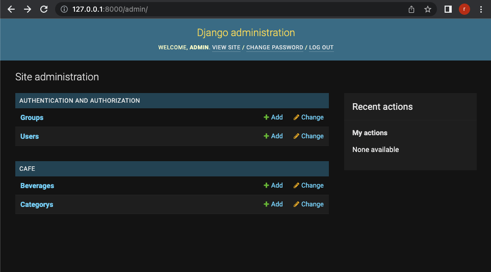
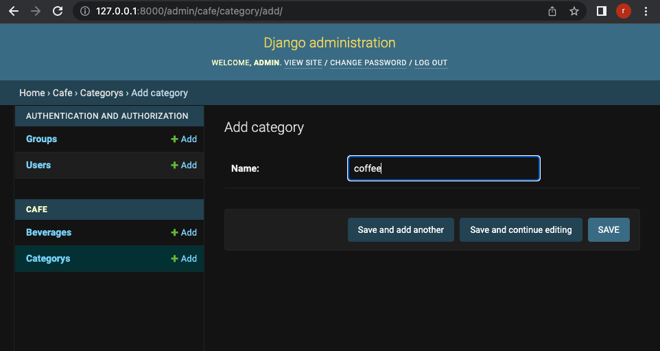
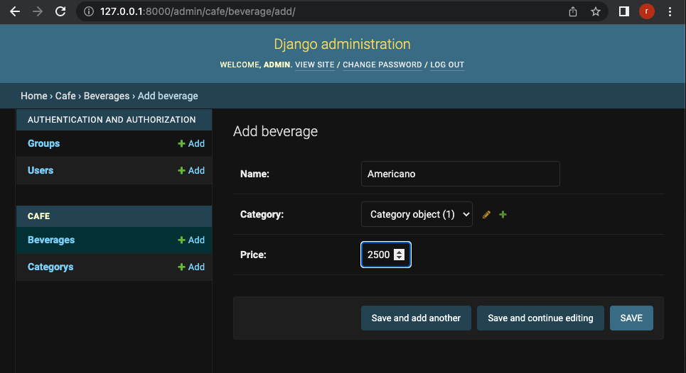
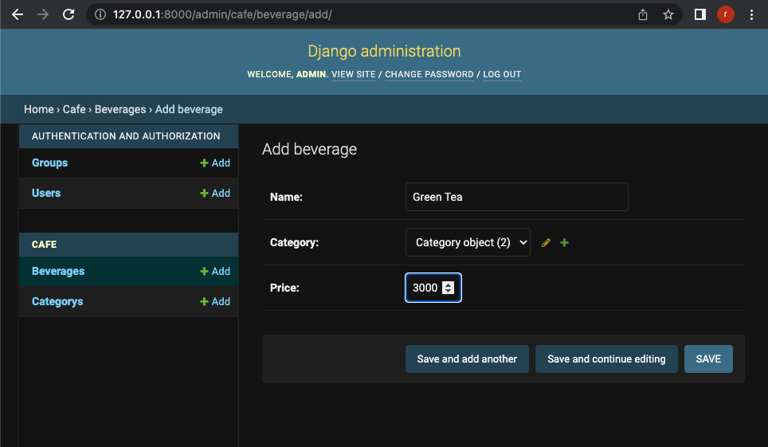

# Django Admin and Register app's model
## Reference
- [Writing your first Django app, part 1](https://docs.djangoproject.com/en/3.2/intro/tutorial01/)
- [Writing your first Django app, part 2](https://docs.djangoproject.com/en/3.2/intro/tutorial02/)

## Test Environments
Python v3.8.2
MacOS v12.2.1
Django v3.2.12

## Install
```shell
$ mkdir django_minimal
$ cd django_minimal
$ python3 -m venv venv
$ source ./venv/bin/activate
$ pip install django==3.2.12
```

Set up a new project as config. Please don't forget write '.'.
```shell
$ django-admin startproject config .
```

Migrate
```shell
$ python manage.py migrate
```

Create a new app as cafe.
```shell
$ python manage.py startapp cafe 
```

Please copy this project's files.

Create migration files for cafe
```shell
$ python manage.py makemigrations cafe
```

Migrate for cafe
```shell
$ python manage.py migrate
```

## Create an admin user
```shell
$ python manage.py createsuperuser
```
Please input admin user info like example below.

- Username: admin
- Email address: taptorestart@gmail.com
- Password: verysecret


## Run
```shell
$ python manage.py runserver
```

Open your browser at 'http://127.0.0.1:8000/admin'


Login as admin


## Add models to admin page

```python
from django.contrib import admin

from .models import Category, Beverage

admin.site.register(Category)
admin.site.register(Beverage)
```

You can see the models on admin page.


You can add a object like below.







