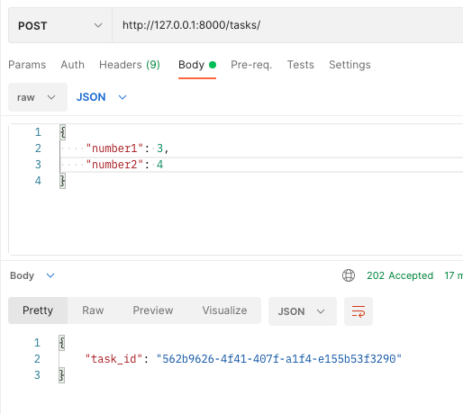
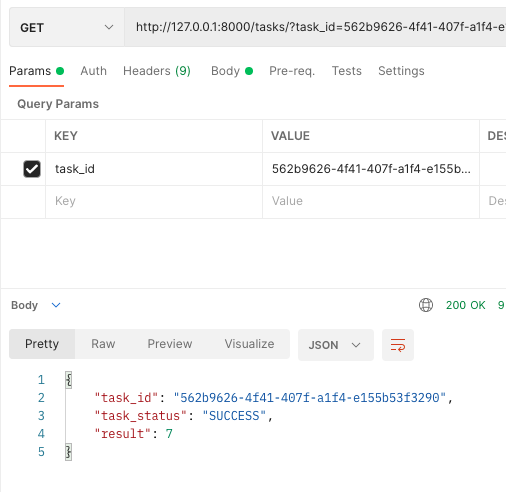

# Django celery worker

## Install
```shell
python3 -m venv venv
source venv/bin/activate
python -m pip install django==3.2.8
python -m django startproject mysite
python manage.py startapp task
```

install redis on Mac
```
$ brew install redis
$ brew services start redis
$ redis-server
```

## Run 

```shell
python manage.py runserver
```

run celery on the other terminal window
```shell
celery -A mysite worker -l info
```

## Test

POST example
```
http://127.0.0.1:8000/tasks/

{
    "number1": 3,
    "number2": 4
}
```


GET example
```
http://127.0.0.1:8000/tasks/?task_id=562b9626-4f41-407f-a1f4-e155b53f3290
```

