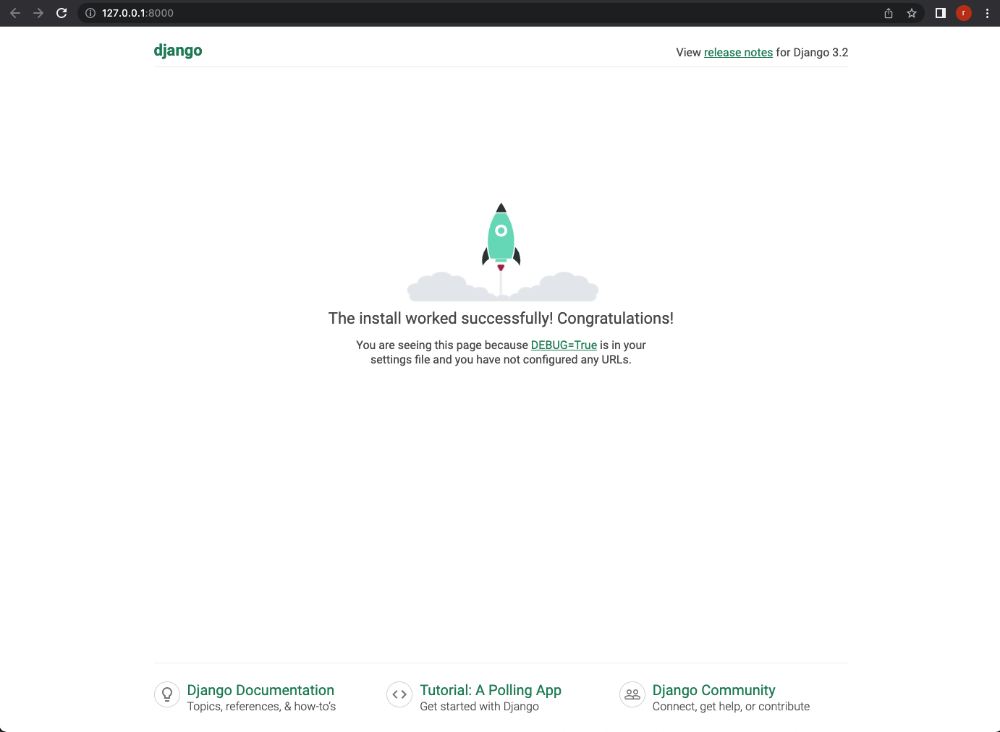

# Django minimal

[mdn: Django introduction](https://developer.mozilla.org/en-US/docs/Learn/Server-side/Django/Introduction)

Source: [Writing your first Django app, part 1](https://docs.djangoproject.com/en/3.2/intro/tutorial01/)


## Test Environments
Python v3.8.2
MacOS v12.2.1
Django v3.2.12

## Install
```shell
$ mkdir django_minimal
$ cd django_minimal
$ python3 -m venv venv
$ source ./venv/bin/activate
$ pip install django==3.2.12
```

Set up a new project. Please don't forget write '.'.
```shell
$ django-admin startproject config .
```

## Migration
```shell
$ python manage.py migrate
```

## Run
```shell
$ python manage.py runserver
```

## Screenshots
Open your browser at 127.0.0.1:8000/


