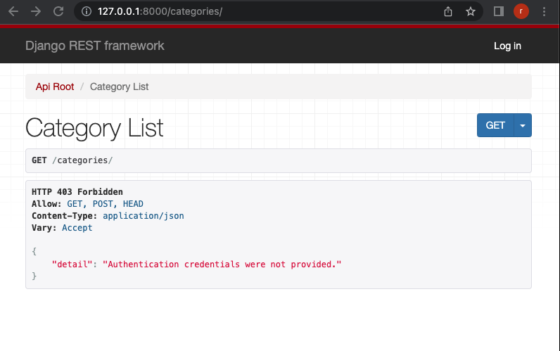
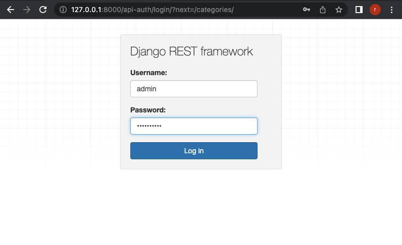
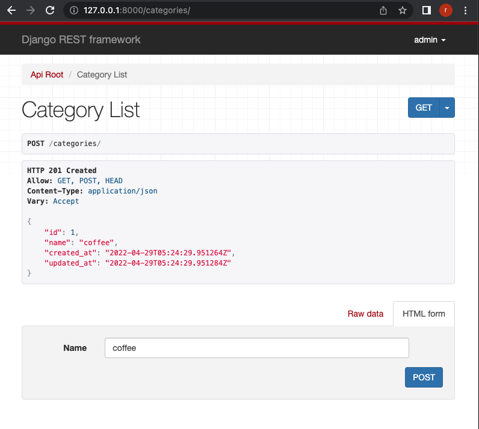
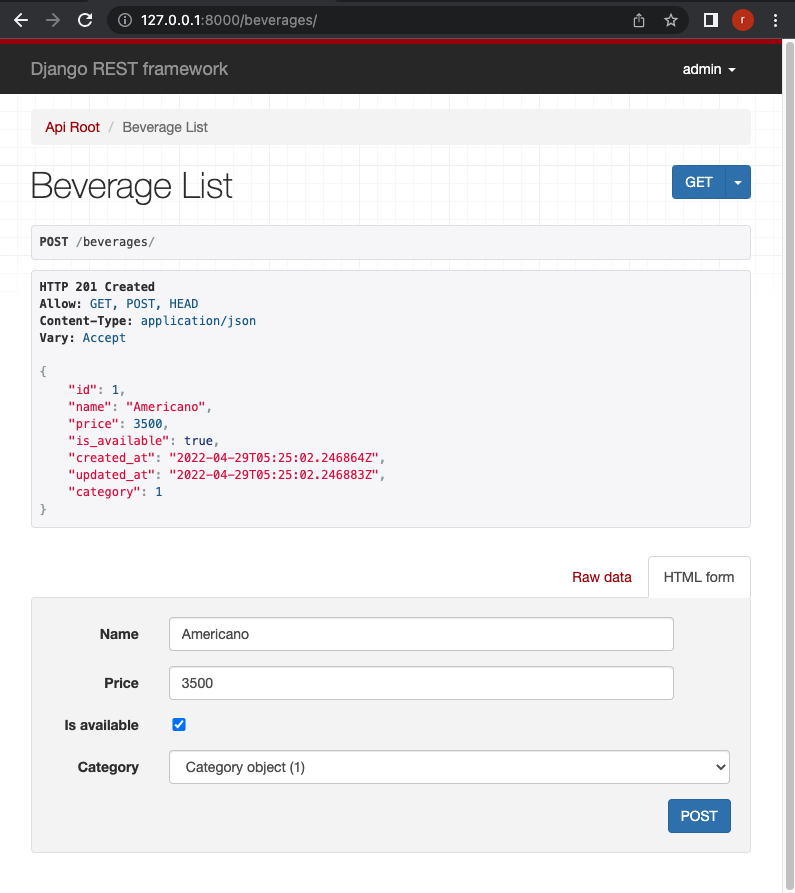
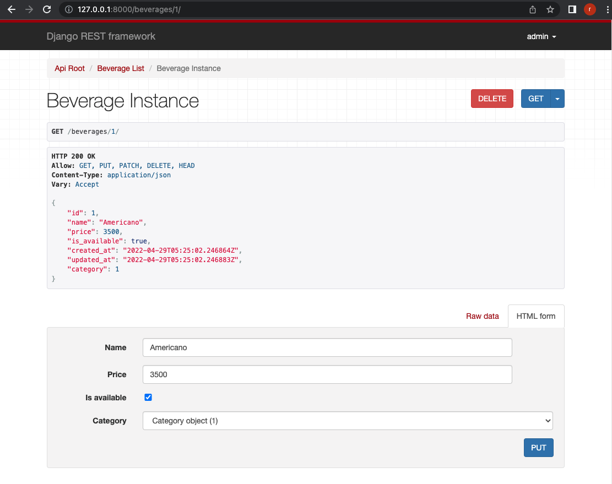
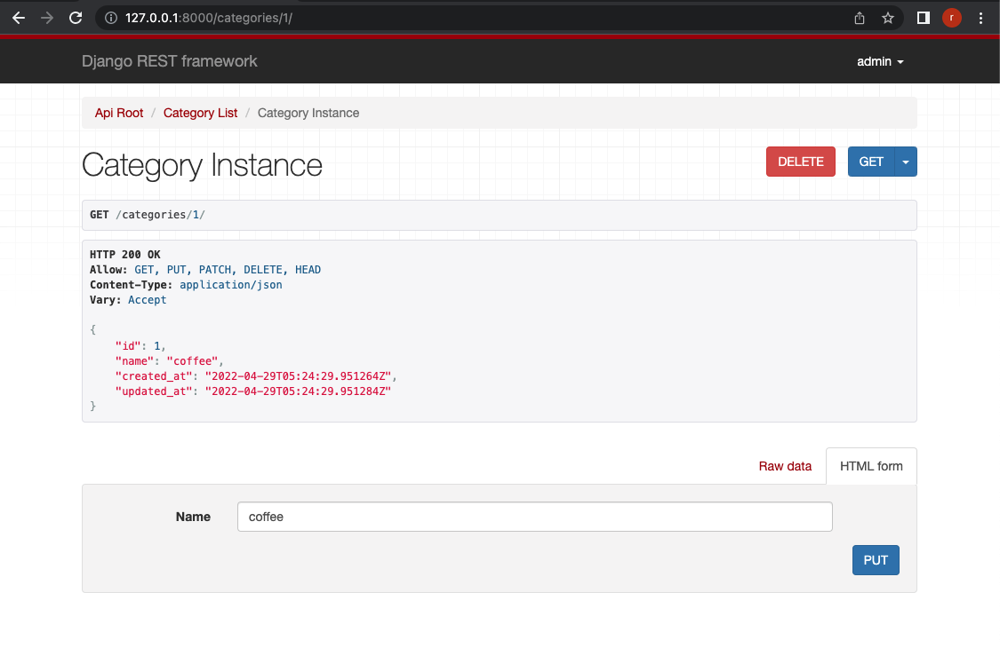

# DRF(Django REST framework) CRUD

## Install

```shell
$ python3 -m venv venv
$ source ./venv/bin/activate
$ pip install -r requirements.txt
```

## Migration
```shell
$ python manage.py migrate
```

## Create admin user
Please input admin's password.
```shell
$ python manage.py createsuperuser --email admin@taptorestart.com --username admin
Password: verysecret
Password (again): verysecret
```

## Run
```shell
$ python manage.py runserver
```

## Screenshots

127.0.0.1:8000/


127.0.0.1:8000/categories



You need to login. Please click Log in button! And input your username and password.



Please add a coffee.



127.0.0.1:8000/beverages

Please add an americano.



127.0.0.1:8000/beverages/1/

You can delete, get, or put.



127.0.0.1:8000/categories/1/

You can delete, get, or put.



