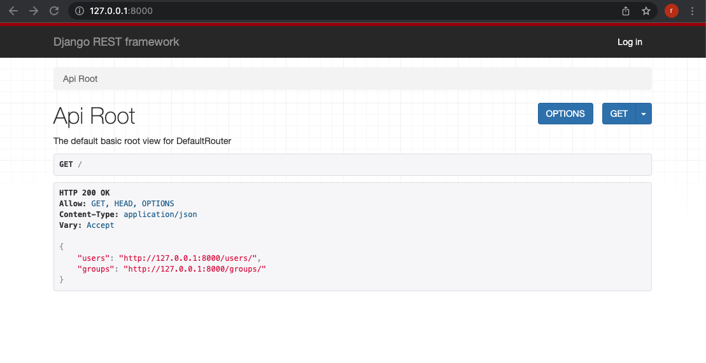
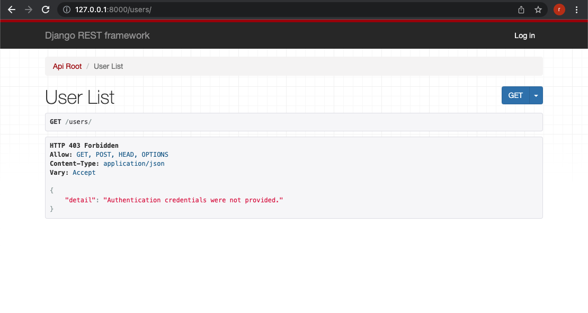
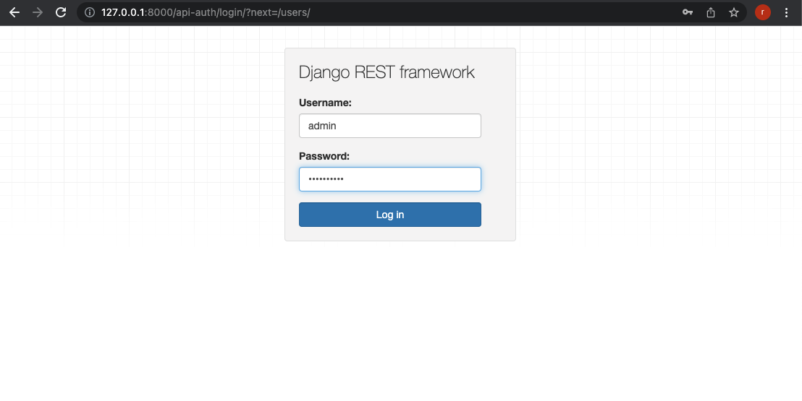
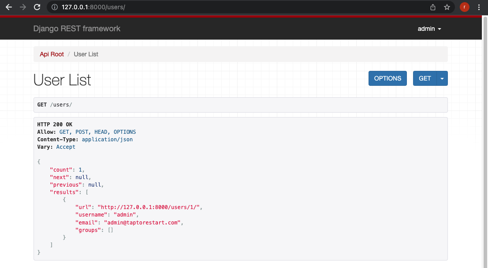
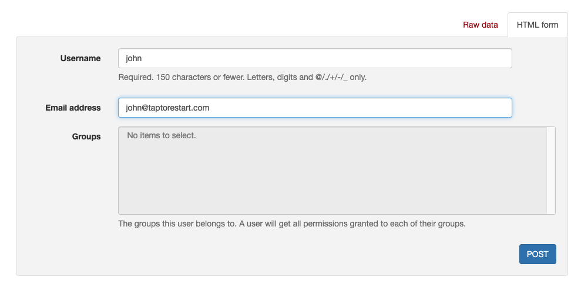
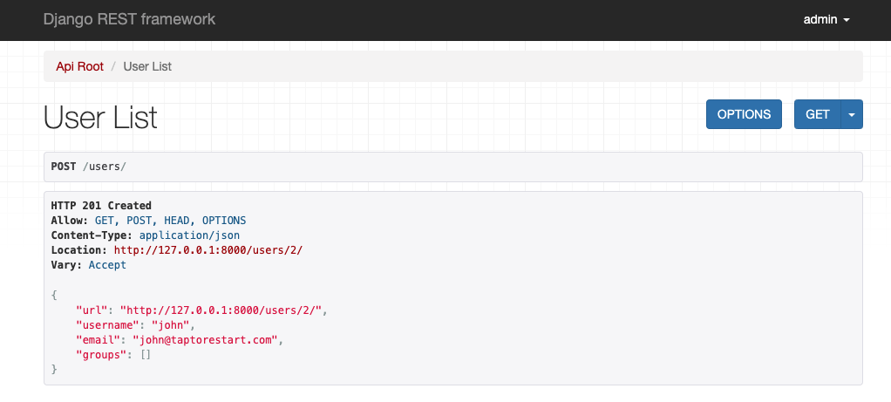
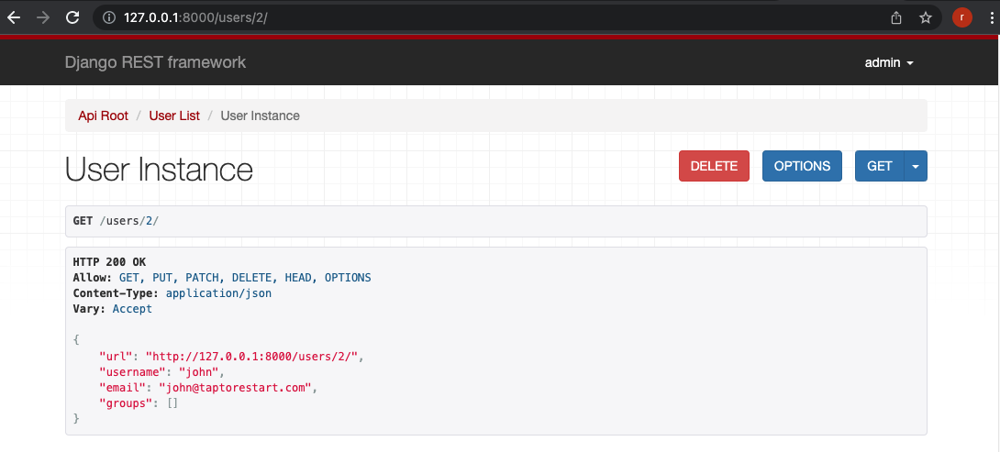
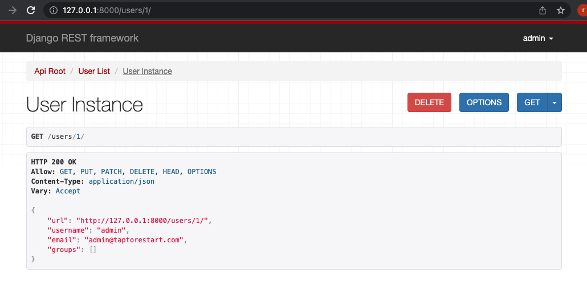

# DRF(Django Rest Framework) minimal
Reference: https://www.django-rest-framework.org/tutorial/quickstart/

## Install

```shell
$ python3 -m venv env
$ source env/bin/activate
$ pip install django==3.2.12
$ pip install djangorestframework==3.12.4
```
Set up a new project with a single application
```shell
$ django-admin startproject project . 
$ django-admin startapp app
$ cd ..
```

## Migration
```shell
$ python manage.py migrate
```

## Create admin user
Please input admin's password.
```shell
$ python manage.py createsuperuser --email admin@taptorestart.com --username admin
Password: verysecret
Password (again): verysecret
```

## Run
```shell
$ python manage.py runserver
```

## Screenshots

127.0.0.1:8000/



127.0.0.1:8000/users/



Click login button! Input your username and password like 'admin' and 'verysecret'.



127.0.0.1:8000/users/ admin



Post new user



Result



127.0.0.1:8000/users/2/



127.0.0.1:8000/users/1/


