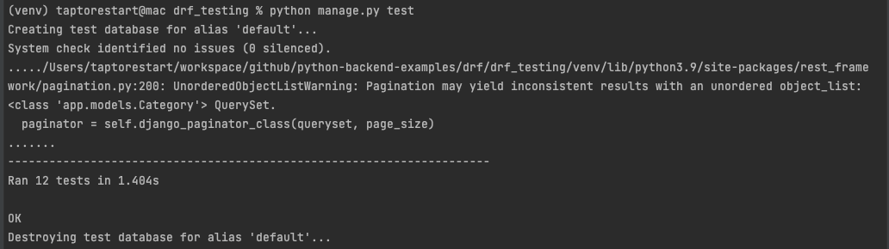

# DRF(Django REST framework) Testing
Reference: 
- [DRF Testing](https://www.django-rest-framework.org/api-guide/testing/)

This example is using [DRF CRUD](https://github.com/taptorestart/python-backend-examples/tree/main/drf/drf_crud).


## Install
```shell
$ python3 -m venv venv
$ source ./venv/bin/activate
$ pip install -r requirements.txt
```


## Test
```shell
$ python manage.py test
```

Result


