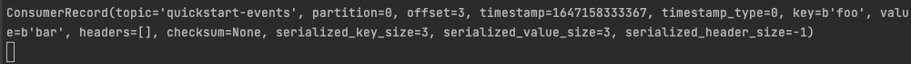

# kafka-python Example
source: [https://github.com/dpkp/kafka-python](https://github.com/dpkp/kafka-python), Apache-2.0 License

## Kafka and MSA(Microservice Architecture)
[How Kafka Solves Common Microservice Communication Issues](https://dzone.com/articles/how-kafka-solves-common-microservice-communication)

## Test Environments
- Python v3.8.2
- MacOS v12.2.1

## Install Kafka
source: [Kafka Quick Start](https://kafka.apache.org/quickstart)

```shell
# Download KAFKA
[https://dlcdn.apache.org/kafka/3.1.0/kafka_2.13-3.1.0.tgz](https://dlcdn.apache.org/kafka/3.1.0/kafka_2.13-3.1.0.tgz)

# STEP 1: GET KAFKA
$ tar -xzf kafka_2.13-3.1.0.tgz
$ cd kafka_2.13-3.1.0

# STEP 2: START THE KAFKA ENVIRONMENT
# Start the ZooKeeper service
$ bin/zookeeper-server-start.sh config/zookeeper.properties

# Start the Kafka broker service
$ bin/kafka-server-start.sh config/server.properties

# STEP 3: CREATE A TOPIC TO STORE YOUR EVENTS
$ bin/kafka-topics.sh --create --topic quickstart-events --bootstrap-server localhost:9092

# STEP 4: WRITE SOME EVENTS INTO THE TOPIC
$ bin/kafka-console-producer.sh --topic quickstart-events --bootstrap-server localhost:9092
This is my first event
```

## Install
```shell
$ python3 -m venv venv
$ sourcce ./venv/bin/activate
$ pip install kafka-python==2.0.2
```

## Run
Produce event
```shell
$ python producer.py
```

Consume event
```shell
$ python consumer.py
```

## Screenshots

