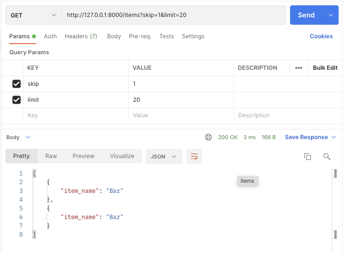
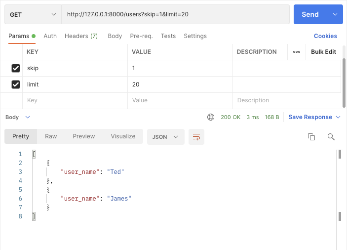

# FastAPI API Router project example
Source: [tiangolo / full-stack-fastapi-postgresql](https://github.com/tiangolo/full-stack-fastapi-postgresql) 

## Environments
Python v3.8.2

## Install
```shell
$ mkdir fastapi_api_router
$ cd fastapi_api_router
$ python3 -m venv venv
$ source ./venv/bin/activate
$ pip install fastapi==0.74.1
$ pip install "uvicorn[standard]"
```

## Run
```shell
$ uvicorn main:app --reload
```

## Screenshots


