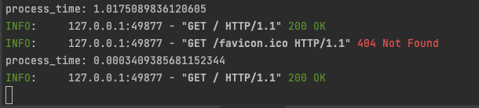

# FastAPI cache with Redis example

This example is using [FastAPI minimal](https://github.com/taptorestart/python-backend-examples/tree/main/fastapi/fastapi_minimal) example.

This example is just to show why we need to use cache with in-memory database like Redis.

Please find some good cache packages: [fastapi-redis-cache](https://github.com/a-luna/fastapi-redis-cache), [fastapi-cache](https://github.com/long2ice/fastapi-cache), etc.

## Install
```shell
$ mkdir fastapi_redis
$ cd fastapi_redis
$ python3 -m venv venv
$ source ./venv/bin/activate
$ pip -r requirements.txt
```

## Install redis 
On MacOS
```shell
$ brew install redis
$ brew services start redis
```

## Run
```shell
$ uvicorn main:app --reload
```

Open your browser at http://127.0.0.1:8000

## Screenshots
Test Result on My Mac mini(2018): Processor 3.2GHz 6-Core Intel Core i7, Memory 64GB


