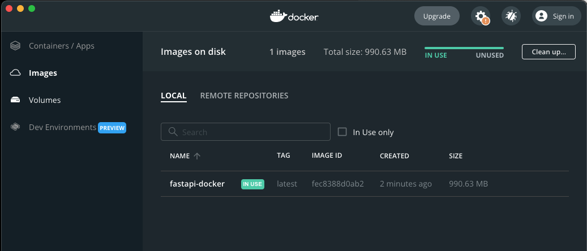
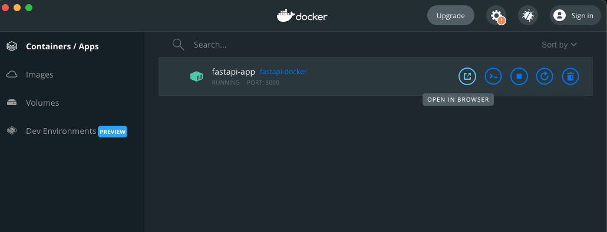
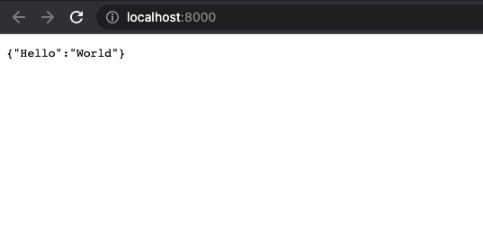

# FastAPI Docker
source: [FastAPI in Containers - Docker](https://fastapi.tiangolo.com/deployment/docker/), MIT License

## Test Environments
Python v3.8.2
MacOS v12.2.1
Docker v20.10.11

## Install
```shell
$ mkdir fastapi_docker
$ cd fastapi_docker
```

## Run
```shell
$ uvicorn main:app --reload
```

## Docker build and run
```shell
# bukld
$ docker build . -t fastapi-docker
$ docker run -d --name fastapi-app -p 8000:80 fastapi-docker
```

## Screenshots
Run "docker build . -t fastapi-docker", then you can see the image. 



Run "docker run -d --name fastapi-app -p 8000:80 fastapi-docker", then you can see the app.

Click open in browser.


See the result.


