# FastAPI - Email Login with Password(and hashing), Bearer with JWT Token, ORM with MySQL
Reference: [Full Stack FastAPI and PostgreSQL - Base Project Generator](https://github.com/tiangolo/full-stack-fastapi-postgresql), MIT License

In this example project, the codes of the above repository used a lot. 

You can use this example as a base project.

## Features
- Email Login
- Users are active or not: Inactive user can't get an access token.
- Superuser: Superuser can read other user data.
- JWT
- MySQL

## Test Environments
Python v3.8.2
MacOS v12.2.1

## Install
```shell
$ pip install -r requirements.txt
$ pip install "uvicorn[standard]"
$ pip install "pydantic[email]"
$ pip install "passlib[bcrypt]"
```

## Envrionment Variables example
Create a secret key.
```shell
$ openssl rand -hex 32
```

Create a .env file like below and save on your project directory where the README.md is.
```
USERNAME=admin
PASSWORD=verysecret
HOST=localhost
PORT=3306
DATABASE=app
SECRET_KEY=24b3fdc346f2e08004a12a3f2c85580d444e02e62bc3284164677abec5419f24
FIRST_SUPERUSER_EMAIL=taptorestart@gmail.com
FIRST_SUPERUSER_PASSWORD=verysecret
```

## Database
Connect your database and create a database.

If you set your database name as 'app', create a database 'app'.

## Run
```shell
$ uvicorn main:app --reload
```

## Screenshots

Running

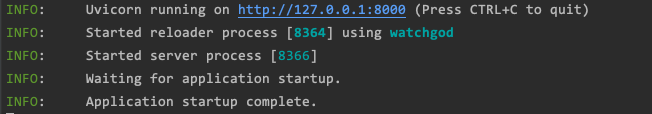

OpenAPI

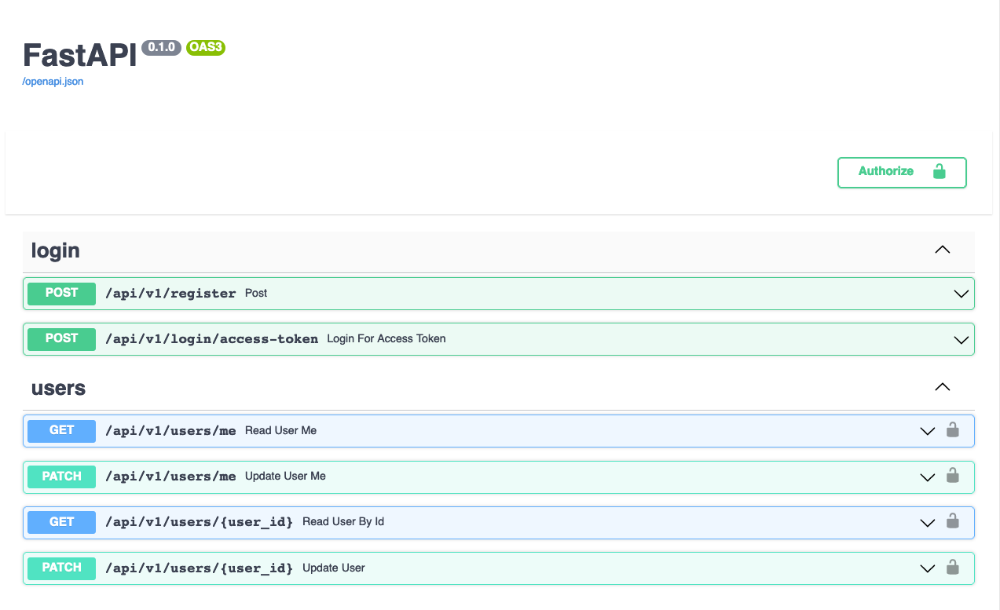

MySQL Database after first running

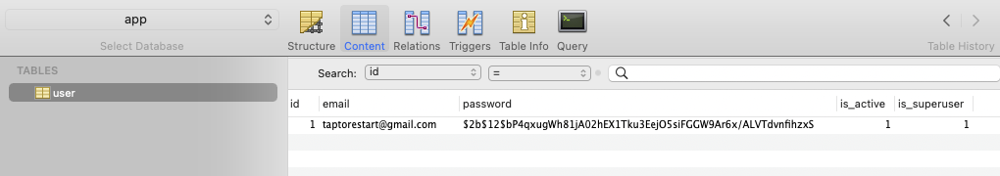

Login as first superuser

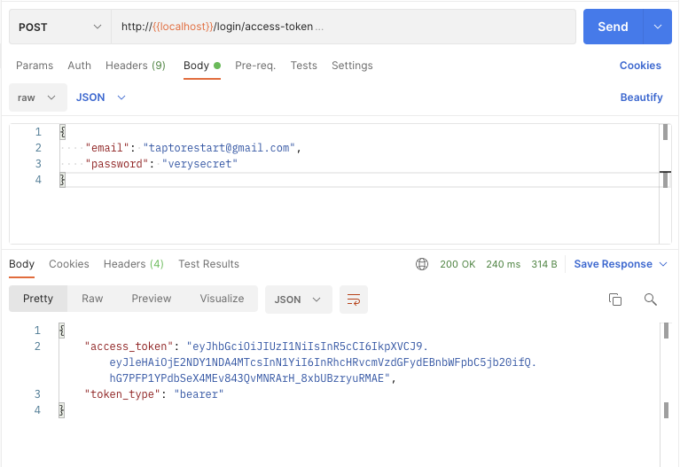

Register user

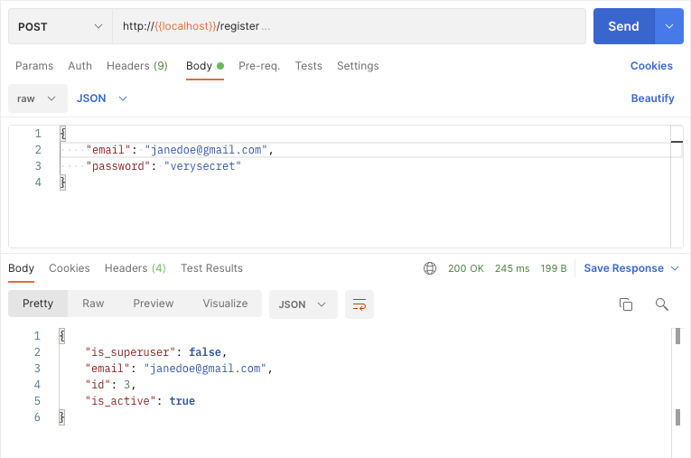

Get a token of new user

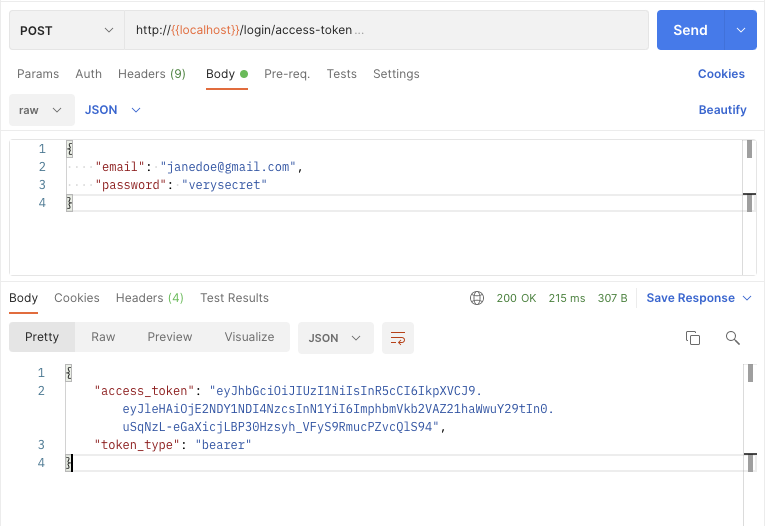

Get an information of new user

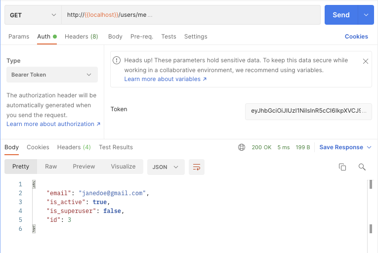

PATCH with Bearer Token

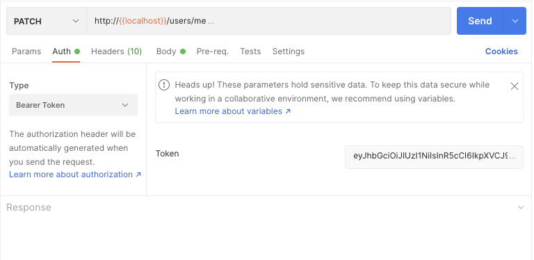

User can change a password with right token. 

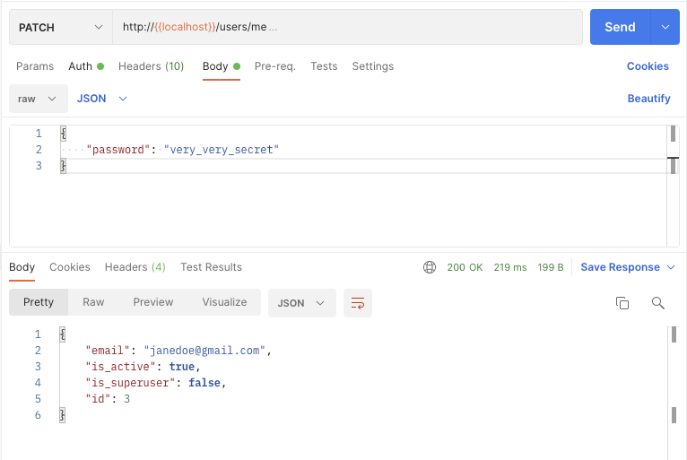

User can't change a password with wrong token.

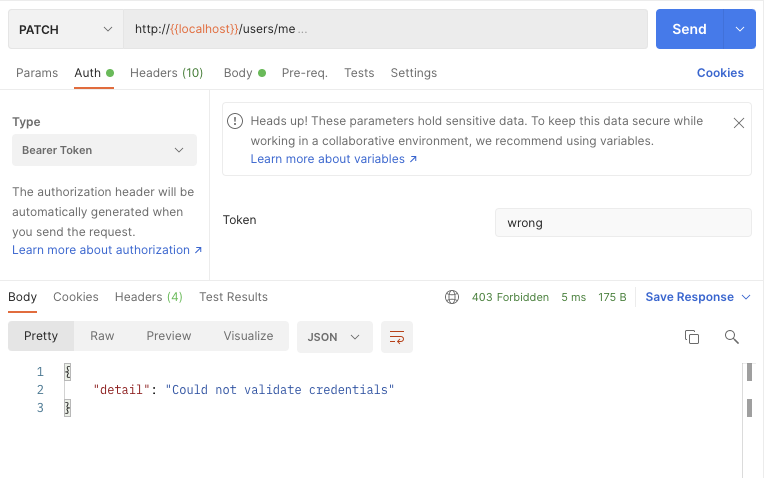

Normal user can't access other user's data.
Example below tried with normal user's token.

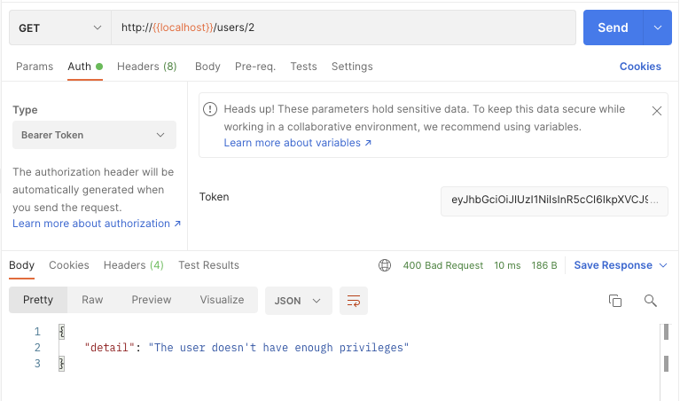

Superuser can read other user's data.

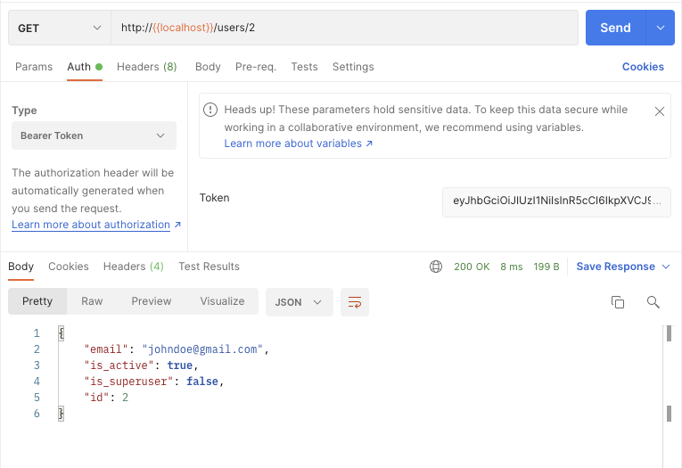

Superuser can update other user's data.

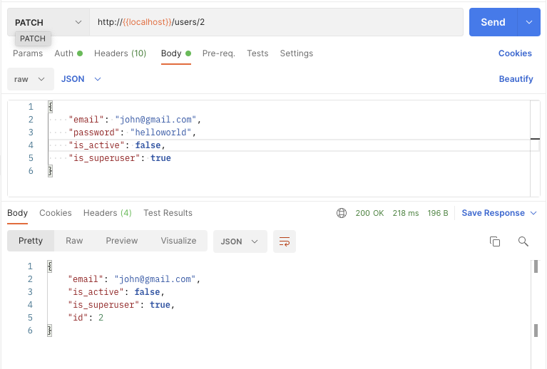

Normal user can't update other user's data.

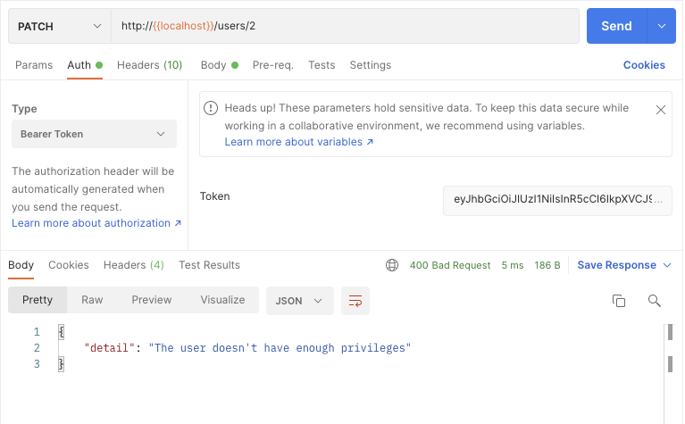
