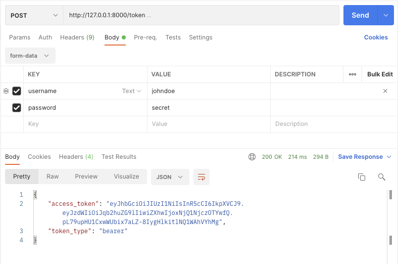
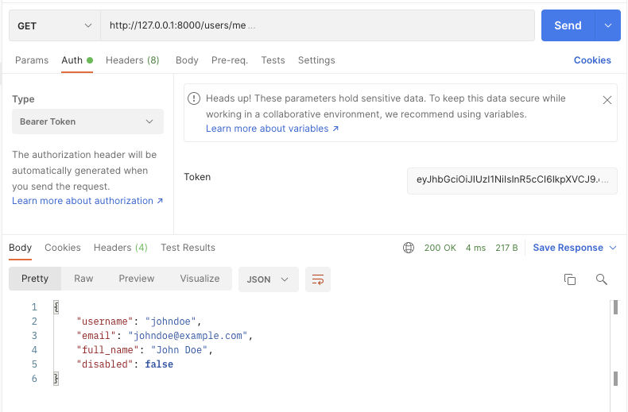
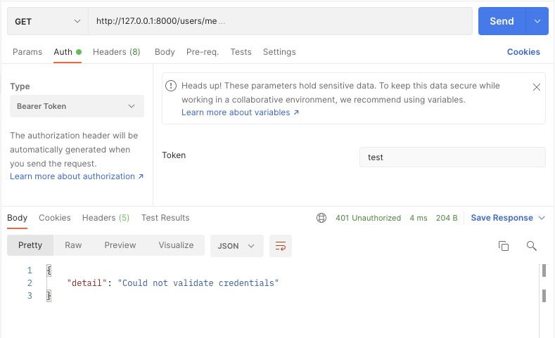

# FastAPI oauth2 jwt project example

source: [FastAPI Tutorial - OAuth2 with Password (and hashing), Bearer with JWT tokens](https://fastapi.tiangolo.com/ko/tutorial/security/oauth2-jwt/)

source license: MIT License

## Environments
Python v3.8.2

## Install
```shell
$ mkdir fastapi_oauth2_jwt
$ cd fastapi_oauth2_jwt
$ python3 -m venv venv
$ source ./venv/bin/activate
$ pip install "uvicorn[standard]"
$ pip install "passlib[bcrypt]"
$ pip install -r requirements.txt
```

## Run
```shell
$ uvicorn main:app --reload
```

## screenshots




