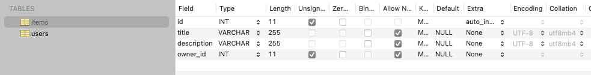
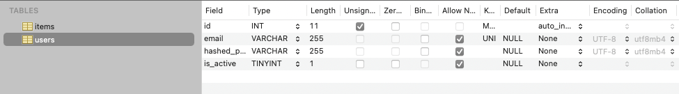

# FastAPI orm with MySQL project example

source: [FastAPI Tutorial - SQL Databases](https://fastapi.tiangolo.com/tutorial/sql-databases/)

source license: MIT License

## Environments
Python v3.8.2
Mysql v5.7

## Install
```shell
$ mkdir fastapi_minimal
$ cd fastapi_minimal
$ python3 -m venv venv
$ source ./venv/bin/activate
$ pip install fastapi==0.74.1
$ pip install "uvicorn[standard]"
```

## Mysql
You need import INTEGER.
```python
from sqlalchemy.dialects.mysql import INTEGER
```
If you want unsigned integer with length 11, you need to set model with "INTEGER(display_width=11, unsigned=True)".
```
INTEGER: signed integer, length 11
INTEGER(unsigned=True): unsigned integer, length 10
INTEGER(display_width=11, unsigned=True): unsigned integer, length 11
```

## Run
```shell
$ uvicorn main:app --reload
```

Open your browser at http://127.0.0.1:8000/docs

## Screenshots


