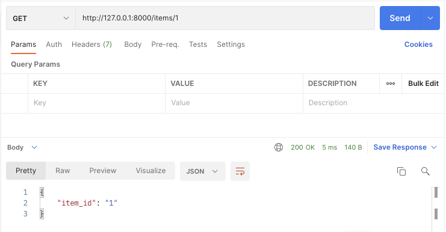
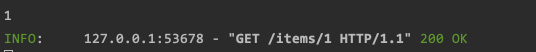

# FastAPI Path Parameters project example

source: [FastAPI Tutorial - Path Parameters](https://fastapi.tiangolo.com/tutorial/path-params/)

source license: MIT License

## Environments
Python v3.8.2

## Install
```shell
$ mkdir fastapi_minimal
$ cd fastapi_minimal
$ python3 -m venv venv
$ source ./venv/bin/activate
$ pip install fastapi==0.74.1
$ pip install "uvicorn[standard]"
```

## Run
```shell
$ uvicorn main:app --reload
```

## Screenshots



