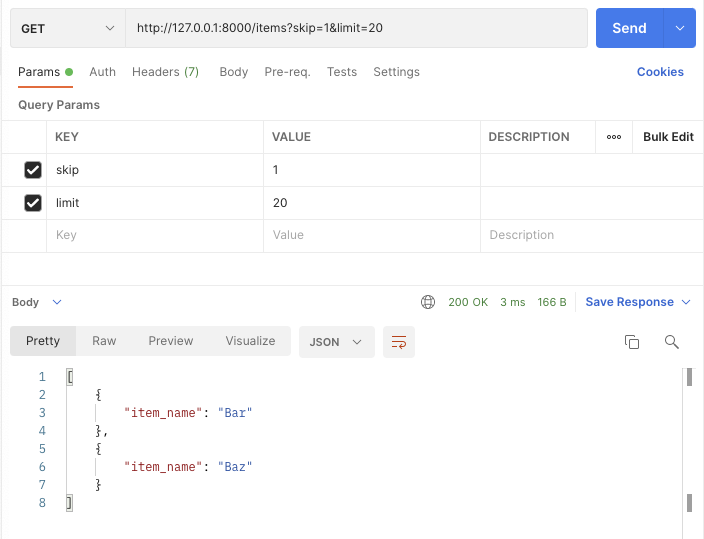
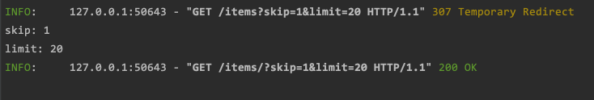

# FastAPI Query Parameters project example

source: [FastAPI Tutorial - Query Parameters](https://fastapi.tiangolo.com/tutorial/query-params/)

source license: MIT License

## Environments
Python v3.8.2

## Install
```shell
$ mkdir fastapi_minimal
$ cd fastapi_minimal
$ python3 -m venv venv
$ source ./venv/bin/activate
$ pip install fastapi==0.74.1
$ pip install "uvicorn[standard]"
```

## Run
```shell
$ uvicorn main:app --reload
```

## Guide
When just add a parameter, it becomes a query parameter automatically.
In the example below, skip and limit are query parameters.
```python
@app.get("/items/")
async def read_item(skip: int = 0, limit: int = 10):
    print(f'skip: {skip}')
    print(f'limit: {limit}')
    return fake_items_db[skip: skip + limit]
```

## Screenshots


