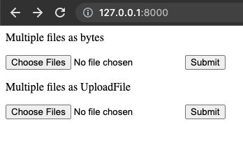
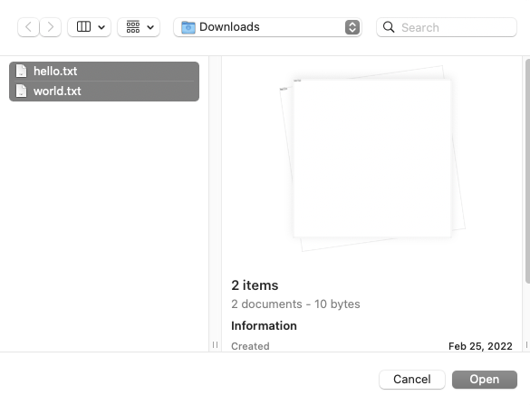
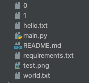

# FastAPI Request Files project example

source: [FastAPI Tutorial - Request Files](https://fastapi.tiangolo.com/tutorial/request-files/)

source license: MIT License

## Environments
Python v3.8.2

## Install
```shell
$ mkdir fastapi_request_files
$ cd fastapi_request_files
$ python3 -m venv venv
$ source ./venv/bin/activate
$ pip install -r requirements.txt
$ pip install "uvicorn[standard]"
```

## Run
```shell
$ uvicorn main:app --reload
```

1. Open browser at 'http://127.0.0.1:8000/'
2. Choose files
3. Submit!

## Screenshots





### Multiple files as bytes


You can't get bytes' filename.
You must set new filename.

### Multiple files as UploadFile


You can get uploadfile's filename.