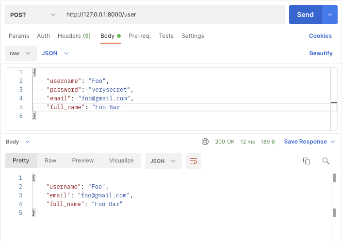
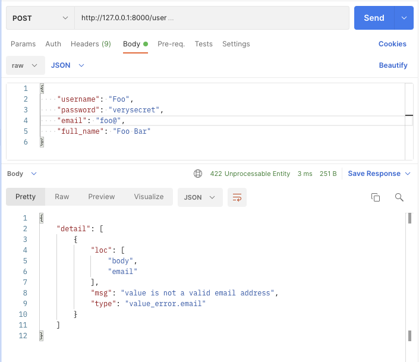
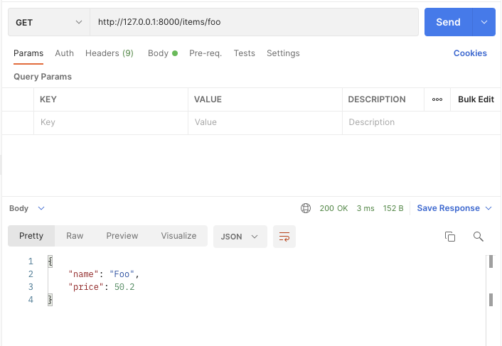
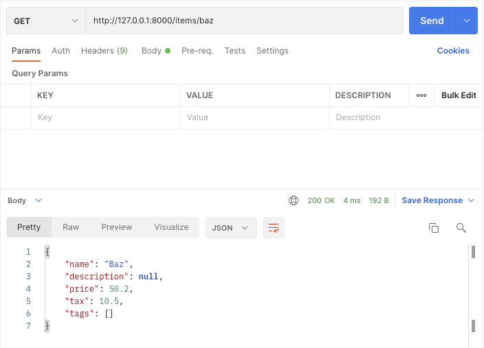
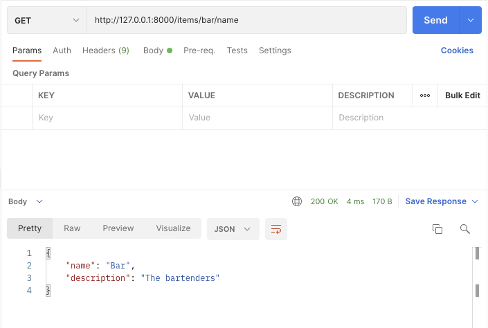
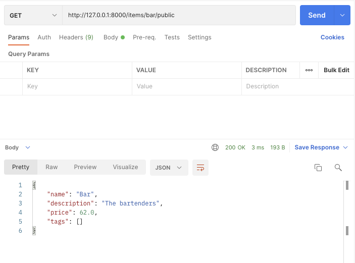

# FastAPI Response Model project example

source: [FastAPI Tutorial - Response Model](https://fastapi.tiangolo.com/tutorial/response-model/)

source license: MIT License

## Environments
Python v3.8.2

## Install
```shell
$ mkdir fastapi_minimal
$ cd fastapi_minimal
$ python3 -m venv venv
$ source ./venv/bin/activate
$ pip install "uvicorn[standard]"
$ pip install "pydantic[email]"
$ pip install -r requirements.txt
```

## Run
```shell
$ uvicorn main:app --reload
```

## Screenshots
```python
@app.post("/user/", response_model=UserOut)
async def create_user(user: UserIn):
```




```python
@app.get("/items/{item_id}", response_model=Item, response_model_exclude_unset=True)
```




```python
@app.get("/items/{item_id}/name", response_model=Item, response_model_include={"name", "description"})
```


```python
@app.get("/items/{item_id}/public", response_model=Item, response_model_exclude={"tax"})
```

