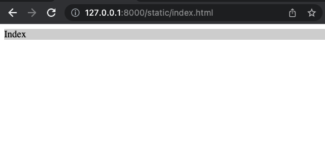
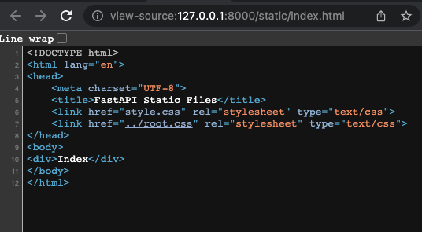
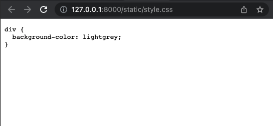
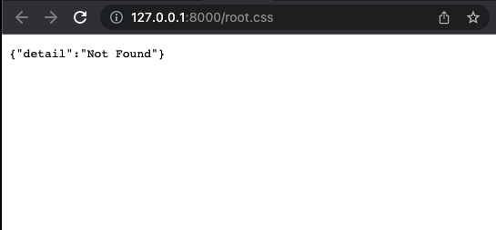

# FastAPI Static Files

source: [Fast API Tutorial - Static Files](https://fastapi.tiangolo.com/tutorial/static-files/)

source license: MIT License

## Install
```shell
$ mkdir fastapi_static
$ cd fastapi_static
$ python3 -m venv venv
$ source ./venv/bin/activate
$ pip install fastapi==0.74.1
$ pip install "uvicorn[standard]"
```

## Run
```shell
$ uvicorn main:app --reload
```

Open your browser at http://127.0.0.1:8000/static/index.html


## Attention
You should separate source files(/app) and static files(/static).

## Screenshots

/index.html



View source



You can access /static/style.css



You can't access root.css


