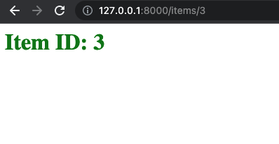
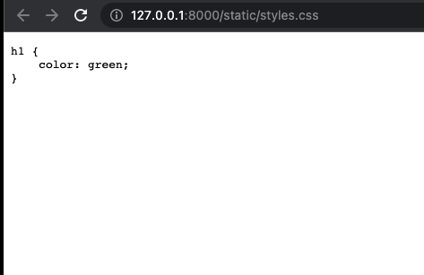

# FastAPI Templates
source: [Fast API Tutorial - Templates](https://fastapi.tiangolo.com/advanced/templates/), MIT License

FastAPI is using [starlette](https://www.starlette.io/). Read this documentation [Templates](https://www.starlette.io/templates/)

Starlette is using Jinja2. Read the [jinja2 documentation](https://jinja.palletsprojects.com/en/3.0.x/api/#jinja2.Environment)

## Test Environments
Python v3.8.2
MacOS v12.2.1

## Install
```shell
$ mkdir fastapi_templates
$ cd fastapi_templates
$ python3 -m venv venv
$ source ./venv/bin/activate
$ pip install fastapi==0.75.0
$ pip install "uvicorn[standard]"
```

## Run
```shell
$ uvicorn main:app --reload
```

## Screenshots

item.html
```html
<html>
<head>
    <title>Item Details</title>
    <link href="{{ url_for('static', path='/styles.css') }}" rel="stylesheet">
    <link href="static/styles.css" rel="stylesheet">
    <link href="/static/styles.css" rel="stylesheet">
</head>
<body>
    <h1>Item ID: {{ id }}</h1>
</body>
</html>
```



View source
```html
<html>
<head>
    <title>Item Details</title>
    <link href="http://127.0.0.1:8000/static/styles.css" rel="stylesheet">
    <link href="static/styles.css" rel="stylesheet">
    <link href="/static/styles.css" rel="stylesheet">
</head>
<body>
    <h1>Item ID: 3</h1>
</body>
</html>
```

If you click "static/styles.css", you will show this message "{"detail":"Not Found"}"


If you click "/static/styles.css", you can see style.css.
So you must set url with "/" like "/static/styles.css"! 


