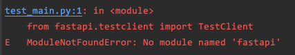

# FastAPI Testing project example

source: [FastAPI Tutorial - Testing](https://fastapi.tiangolo.com/tutorial/testing/)

source license: MIT License

## Test Environments
Python v3.8.2
MacOS v12.2.1

## Install
```shell
$ mkdir fastapi_testing
$ cd fastapi_testing
$ python3 -m venv venv
$ source ./venv/bin/activate
$ pip install "uvicorn[standard]"
$ pip install -r requirements.txt
```

## Using pytest
You need to install requests for pytest.
```shell
$ pip install requests==2.27.1
```

## Run
When you just run pytest, there will be some errors like below
```
    from fastapi.testclient import TestClient
E   ModuleNotFoundError: No module named 'fastapi'
```


You must run 'python -m pytest'.

```shell
$ python -m pytest
```


