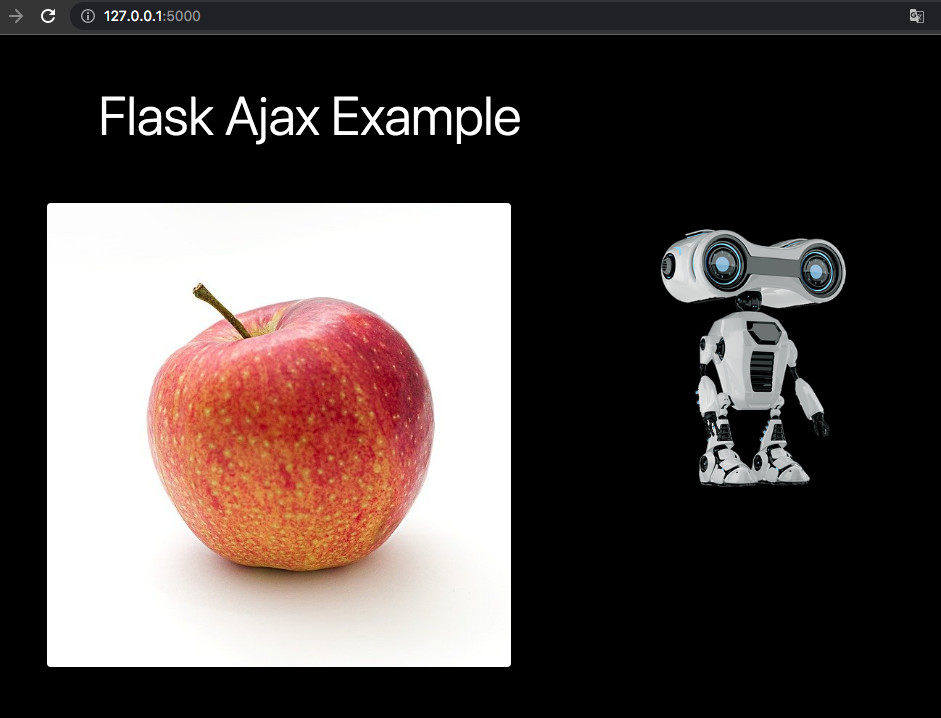
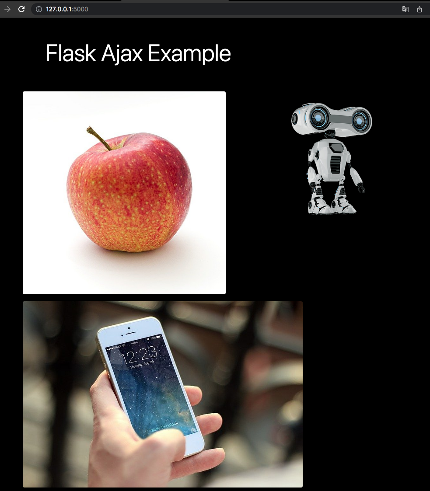

# Flask ajax example

## Install
```shell
mkdir flask_ajax
cd flask_ajax
python3 -m venv venv
source ./venv/bin/activate
pip install Flask==2.0.1
```

## Run
```shell
export FLASK_ENV=development
flask run
```

## source of images
- 01.jpg source: [pixabay](https://pixabay.com/photos/apple-red-fruit-food-fresh-ripe-1834639/)
- 01_result.jpg source: [pixabay](https://pixabay.com/photos/iphone-smartphone-apps-apple-inc-410324/)
- 02.jpg source: [pixabay](https://pixabay.com/illustrations/robot-machine-technology-modern-6654029/)
- 02_result.jpg source: [pixabay](https://pixabay.com/photos/samsung-smartphone-phone-technology-5188631/)

## screenshots

