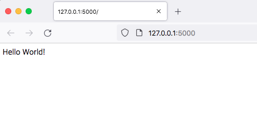

# Flask minimal project

## Install
```shell
mkdir flask_minimal
cd flask_minimal
python3 -m venv venv
source ./venv/bin/activate
pip install Flask==2.0.1
```

## Make file app.py
Type below codes.

```python
from flask import Flask

app = Flask(__name__)


@app.route('/')
def hello():
    return 'Hello World!'
```

## Run
```shell
export FLASK_ENV=development
flask run
```

That's all.
Open your browser, and type url 'http://127.0.0.1:5000/'.

