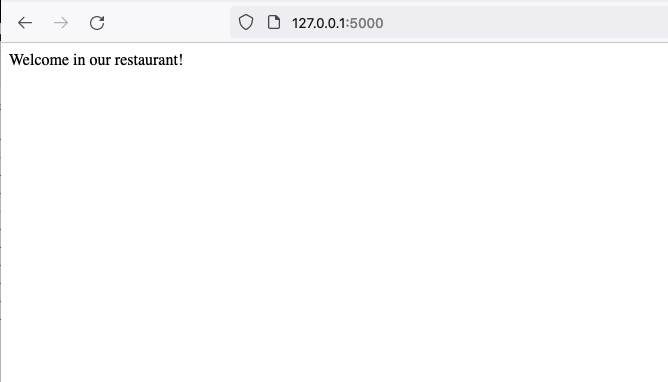
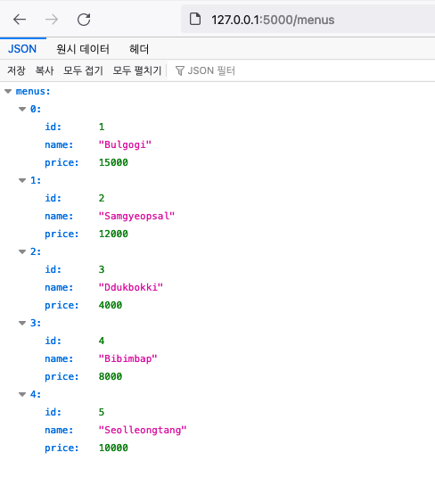
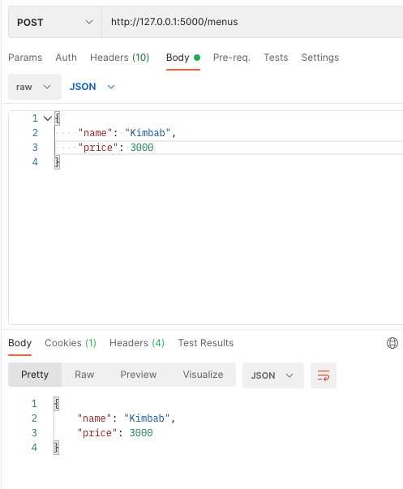
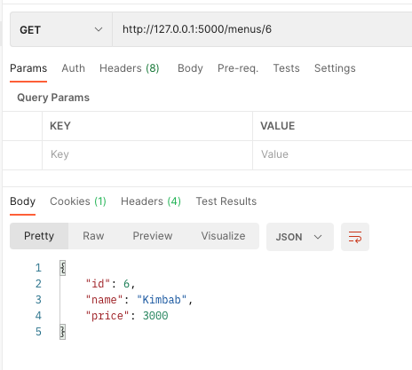
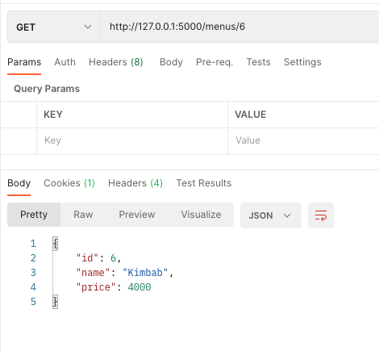
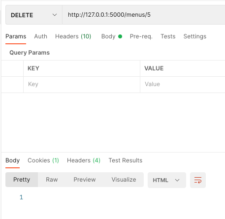
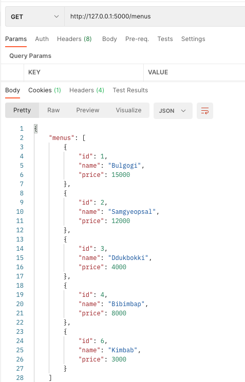

# Flask ORM example project

## Install
```shell
mkdir flask_orm
cd flask_orm/
python3 -m venv venv
source venv/bin/activate
pip install flask
pip install flask_sqlalchemy
```

## Make sqlite database
```shell
python init_db.py 
```

## Check data
```shell
python list.py
```

Result
```
id: 1
name: Bulgogi
price: 15000 WON
id: 2
name: Samgyeopsal
price: 12000 WON
id: 3
name: Ddukbokki
price: 4000 WON
id: 4
name: Bibimbap
price: 8000 WON
id: 5
name: Seolleongtang
price: 10000 WON
```

## Run
```shell
export FLASK_ENV=development
flask run
```

## References
https://flask.palletsprojects.com/en/2.0.x/
https://flask-sqlalchemy.palletsprojects.com/en/2.x/

## Test Example














