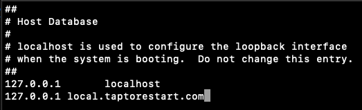
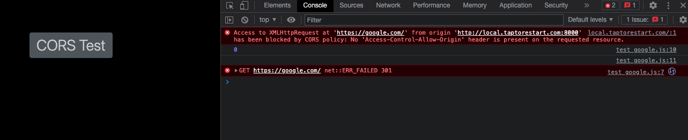
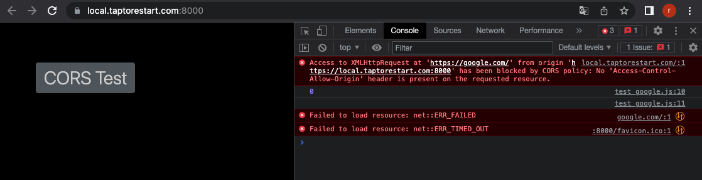

# CORS Test using Flask

[CORS](https://developer.mozilla.org/en-US/docs/Web/HTTP/CORS)

## Environments

- MacOS v13.2.1
- Python v3.8.10

## Set hosts on Mac
```
$ vi /etc/hosts
```
Add your host like below:

127.0.0.1 localhost
127.0.0.1 local.taptorestart.com



## Install 

```
$ python -m venv venv
$ source ./venv/bin/activate
$ pip install -r requirements.txt
```

## Install mkcert for https
MacOS
```
$ brew install mkcert
$ brew install nss  # for Firefox
$ mkcert -install
$ mkcert localhost
or your site! ex: local.taptorestart.com
$ mkcert local.taptorestart.com
```

You can see results as shown below.
```
% mkcert local.taptorestart.com
Note: the local CA is not installed in the Firefox trust store.
Run "mkcert -install" for certificates to be trusted automatically ⚠️

Created a new certificate valid for the following names 📜
 - "local.taptorestart.com"

The certificate is at "./local.taptorestart.com.pem" and the key at "./local.taptorestart.com-key.pem" ✅

It will expire on 6 July 2025 🗓
```

Now you can use https with pem files.

## Run

Run app.py
```
$ python app.py
```

Run app_ssl.py
```
$ python app_ssl.py
```

Open your browser and test.

## Screenshots

Test https://google.com. You can see a CORS error like below.

from origin http://local.taptorestart.com:8000



from origin https://local.taptorestart.com:8000


