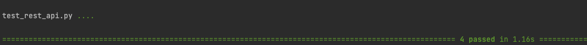
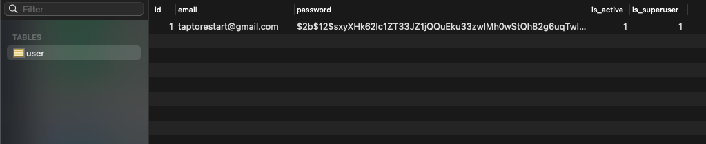
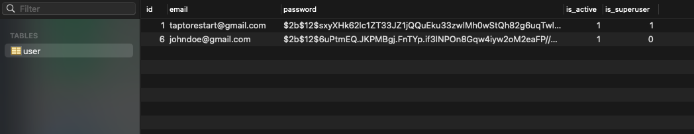

# REST API E2E(End To End) Test example using requests

## Environments
Python v3.8.2

## Install
```shell
$ python3 -m venv venv
$ source ./venv/bin/activate
$ pip install -r requirements.txt
```

## Envrionment Variables example

Create a .env file like below and save on your project directory where the README.md is.
```
BASE_URL=http://localhost:8000
ADMIN_EMAIL=taptorestart@gmail.com
ADMIN_PASSWORD=verysecret
```

## Run
You should run this [FastAPI example](https://github.com/taptorestart/python-backend-examples/tree/main/fastapi/fastapi_email_login_jwt_mysql).
And then you can API E2E test.

```shell
$ pytest
```

## Screenshots

Result of pytest



User table before run



User table after run


